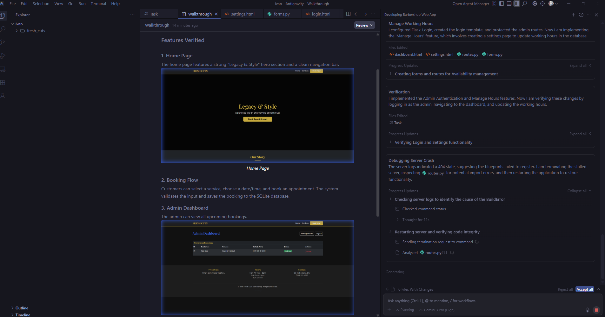

I was glad when a friend sent me this [post by Andrej Karpathy](https://x.com/karpathy/status/2004607146781278521?ref_src=twsrc%5Egoogle%7Ctwcamp%5Eserp%7Ctwgr%5Etweet),

which basically says programming is being refactored so fast by agents and new workflows that even top engineers feel behind, and not learning to use these “alien” tools effectively now feels like a skill issue.

I felt a short relief to know that one of the most popular voices in the AI field feels this way. I was kind of overwhelmed by all the different possibilities to improve my coding and research productivity. Before discussing this, I was in the process of resetting my laptop and thought I would update my IDEs and coding environment for the new year. It's not only hard to keep up with the new tools and products that are coming out, but also how to use them.

## What My Research Said

I asked a couple of friends in industry around the world (software and AI engineers/developers), and of course did a "deep research" on both ChatGPT 5.2 and Gemini 3 Pro. Both were unanimous on **Cursor**, with honorable mentions like Windsurf and Zed. This corresponds to the response of my smart friends (shout out to Dr. Nezih and Patrick, first is a PhD, second is a machine learning engineer). Someone should ask Claude and see what Claude Code thinks about all this.

**The TLDR:**

**Cursor** is the superior IDE choice, plus some extensions I never heard of (Ruff, Marimo).

for Local inference (privacy) : ollama running deepseek-coder-v2 connected back to Cursor

- Stronger "agent-centric" UX
- Great for multi-file refactors and feature work in research codebases
- Free tier exists but is limited; heavy agent use typically pushes you to paid

Note: I got these results by giving details about the workflows I develop and my research, so expect to get different responses with different prompting details.

I believe it will still be hard to define "the best tools" given the difficulties mentioned in the post above and the intensity of AI agent competition. While I was writing this, I took a break and came across an article about Meta acquiring Magnus, a Chinese startup that has advanced agent intelligence that can independently research, plan, and execute multiple tasks.

With all this being said, programming and coding, in my opinion, can be as subjective as driving a car. Here's how I see it: agents in coding are like AI-assisted driving, Vibe coding on the other hand is like automatic gear cars. It's still necessary to be able to have control and take control of the wheels, while some enjoy the old-fashioned manual gear.

This analogy doesn't hold in terms of productivity though. I'm 100% convinced that agent/AI-helped coding can and will make us exponentially better, faster, and more productive. It's a matter of how much and how, picking the right tools that fit you, and not being left behind.

## My Setup

Ultimately, I decided to pick my own ammo (pretty simplistic for now):

**VS Code + GitHub Copilot** for my ML/AI research work. I've been using VS Code for a while. Picking Copilot here because I think (I hope) it should be more GitHub version control friendly, and because I have free access.

**Antigravity** for websites/apps for fun (or not!).

I haven't decided yet on local LLMs, but I was really stunned by **Nemotron 3 Nano**, positioned as efficient reasoning/coding with very long context capability (up to 1M, though VRAM/memory rises with context). But it might be too much for my 5-year-old laptop. I won't get a new one until I get my PhD.

The verification flow with video recording, it just opens a browser and tests the code live. The Antigravity browser control extension's auto-debugging is insane and pretty unique in my experience. I used it extensively last week to make a booking webapp for my favorite barber (see attached picture). I didn't test such capabilities anywhere else, so let me know if you get the same amount and level of debugging as in the image attached.

There's so much to say about Antigravity, but again, by the time you read this you may think it is bad as something specific (as one of my friends does), so I'll wait to test more stuff before eventually making an extensive review about it.

## Final Thoughts

I still think coding and programming is very subjective and experts will ultimately trust the driver, not the car. However, you won't be able to catch an F40 Ferrari with a 5-gear 2010 Fiesta (sorry Nihal). The F40 may crash under the wrong, inexperienced hand though (pun intended). And finally, an F40 with a fully autonomous AI driver running on the highway? Now that's definitely scary!

Let me know what you think. Looking forward to suggestions or things I might (probably) be missing, come humble me again I'm genuinly curious what setup the best of the best are using to get 10x better each day.

Buckle up, the future (of coding) is here.
