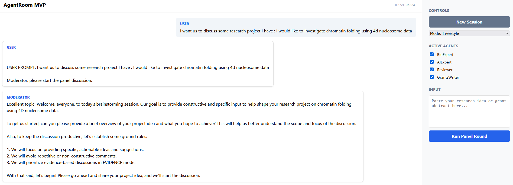

This post is the first in a series on "Agentic AI Programming" where I’ll experiment with different tools, agents, and ADKs (Agent Development Kits) I’ve tried. I will be sharing my experience compared to how the tools are advertized.

## The New Era of Creation

I always thought coding was like having a super power. But this brings content and software creation to the next level (no wonder why the stock market is freaking out). I can’t remember the last time I was this excited about creating and developing solutions. 

At the same time, I feel a little bit .frustrated that I don't have enough time to test, and evaluate every idea I have. I'm in the last semester of my PhD, facing tons of obligations. The frustration persists because I see so many people doing cool things despite their obligations, so I can't find excuses. I just don't want to be left behind. (Note: some of the things I wrote in my [previous post](../2025-12-30-my%20thoughts%20on%20AI%20and%20Agent%20Coding%20tools/index.qmd) are already kind of deprecated! That's how fast things move.)

## Enter: Scholar Agent Room

Since I was working on some grant writing, I decided to take the opportunity to investigate a specific aspect of Agentic AI: Multi-Agent Conversational Systems. I read good things about AutoGen in the scope of conversational chat rooms, so that’s what I decided to go with for this project.

The result is the [ScholarAgentRoom](https://github.com/NazimBL/ScholarAgentRoom) — an expert multi-agent room designed specifically for scientific brainstorming.

### What it does

The goal was to build a system that could act as a rigorous scientific panel. I set up four specialized agents, each with focused system prompts to simulate a real academic review board:

*   **BioExpert**: Focuses on mechanistic plausibility and experimental feasibility.
*   **AIExpert**: Handles data requirements, modeling strategies, and evaluation metrics.
*   **Reviewer**: Adopts an "NIH-style" rigor to provide critical feedback and identify weaknesses.
*   **GrantsWriter**: Ensures clarity, significance, and proper innovation framing.

### Modes of Operation

I wanted flexibility, so I implemented two modes:

1.  **Freestyle**: A more relaxed, open-ended discussion where agents freely exchange ideas.
2.  **Evidence Mode**: This is where it gets interesting. Agents are forced to structure their critiques using a strict framework: *Claim – Evidence – Risk – Improvement – Confidence*. This prevents hallucination and vague feedback.

### Privacy and Architecture

One critical aspect of this project was privacy. We do not want our research ideas flying off to a public API log somewhere. 

I set up the infrastructure to run on a remote GPU cluster, accessed securely via an SSH tunnel. The local UI connects through this tunnel to the backend on the cluster, which then talks to a local LLM server. This ensures that while I use a nice web interface locally, the heavy lifting happens on the cluster, and everything stays private and encrypted.

## Future Work

Like everything in this space, this project could have so many iterations and directions. The repository itself lists plenty of future enhancements, from "Agent Memory" to "Team Variants" like swarm behaviors.

I’m really looking forward to seeing what my fellow collaborators and professors think about it. It’s an experimental tool, but it feels like a glimpse into how we’ll all be doing research fundamentally differently in the very soon.

Check out the code and the full breakdown on the repo:  
[**github.com/NazimBL/ScholarAgentRoom**](https://github.com/NazimBL/ScholarAgentRoom)
