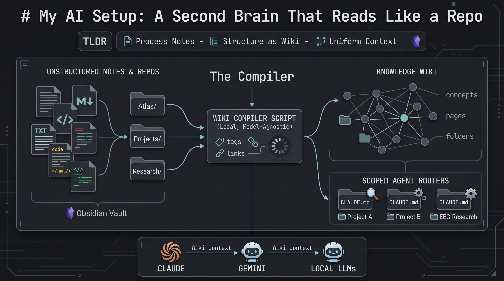
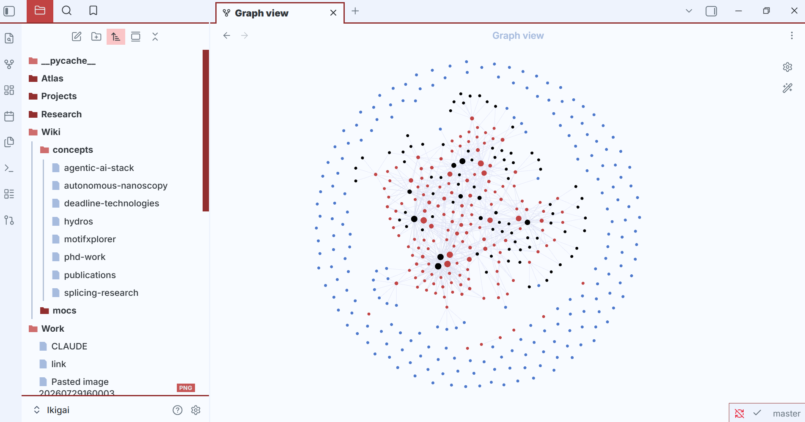

**The TLDR:**

**What?**: I put together a script that scans a year of scattered notes, research, and projects, tags them, links them, and compiles the result into a wiki any LLM can read.

**So what?** If you've had an AI assistant or chatbot, sometimes you notice it loses the thread of a long conversation, focuses on the wrong things, or forgets everything the second a new session starts. It's not only long chats — point Claude Code, Codex, or any coding assistant at a real project and you hit the same wall from the other side: you're either uploading way more files than the question needs, or hunting through folders trying to guess which one gives enough "context."

**Now what?**: Every model I open now gets the same context without me re-explaining myself, none of that memory depends on one company or model, and nothing about my research or my ideas has to leave my machine to get useful answers.

## The problem

You've felt this even if you've never called it "context engineering." A long chat with ChatGPT, DeepSeek, Claude, or Gemini starts overfitting to some random fragment from five messages ago. When you haven't set it up to remember anything, it goes the other way: full amnesia every session, re-explain yourself from zero.

Neither is a model-capability problem. It's just that nothing survives the scroll. The thing that mattered in message two is diluted by message forty, and the model has no way to tell load-bearing context from noise.

## Enter: the Compiler

I got the main idea from the now well-popular Andrej Karpathy LLM wiki repo. The main takeaway from the approach described in his gist was that the correct way to use an LLM over your own knowledge isn't Q&A, it's *compilation*. Raw material (files, code, notes) stays untouched. The LLM's job is to read it and maintain a separate, structured layer on top: a wiki that gets rebuilt, not a chat log that gets scrolled past.

Anyone who's used a coding agent already knows why it works: those tools are noticeably better inside a real repo than in a stray folder of scripts, because a repo carries structure the model can navigate — file layout, imports, a README, commit history. A year of notes is the same raw material, just unstructured. Compiling turns it into something with the shape of a repo: tagged, cross-linked, indexed.

## How I built mine

Obsidian started as a local, markdown-based note-taking app. It turned into an actual knowledge base once there was enough in it, and from there it was a short step to wiring that knowledge base into an LLM directly.

I connected Obsidian to my home folder (referred to as "Vault"), then split it into three top-level folders: `Atlas/` for concepts and general notes, `Projects/` for ventures and builds, `Research/` for research and PhD-level material.

On top of that sits a compiler I wrote. It scans the whole vault, finds tags and shared attributes, flags notes talking about the same thing from different folders, and writes a report. A root `CLAUDE.md` reads that report and does the actual tagging and linking pass, then compiles a second layer: the `Wiki/` layer — one page per tag, plus concept pages that pull a single subject together across folders instead of leaving it scattered as unrelated notes.

## CLAUDE.md (or planner.md) as a router

Each project folder also gets its own scoped `CLAUDE.md`, a local router, separate from the root one. A coding project I'm building doesn't need the same `CLAUDE.md` as the wiki compiler, and it definitely doesn't need the one sitting in my EEG research folder, which is overfitted to EEG-specific knowledge. Each one stays scoped to its own folder instead of leaking into the others. One general `CLAUDE.md`, a `planner.md`, and a `memory.md` aren't enough on their own — I found that scoping them per-folder is what actually solves the context problem described above.

Adding to this, I've also got a small set of specialist agents sitting on top of the same vault (researcher, software engineer, task manager). I use them two ways: called by name directly in Claude Code, or run through a script that translates the agent files so they work with other models too.

## Extra payoffs that matter as much as the wiki itself

**It's model-agnostic.** In my opinion (which could be just paranoia), current pricing for what tools like Claude Code and Codex can do is mostly labs racing each other for market share. I'm not convinced those prices and that accessibility will hold. Everything here is plain markdown, nothing locked into one vendor's format. My daily driver is a base Claude subscription; when I run out of credits, Gemini CLI and a couple of local models pick up the slack. Point the whole setup at a different provider and nothing about the vault needs to be rebuilt.

**It's actually private.** Nothing here depends on uploading research notes or half-formed ideas to a chatbot to get an answer. The vault lives in a private repo, and the compiler runs locally against files on my own machine.

## The second brain

I've spent a lot of time trying to figure out the best AI tools and combinations to actually use day to day. This is the one that stuck: markdown notes, a compiler, and a wiki layer sitting on top of both. One place, one source of truth, a lot less friction picking which tool or model to use, and a lot less re-explaining myself to whatever model I happen to have open.

The app I take notes in is now also my knowledge base and the repo I actually work from. I still run WSL with VS Code open next to Obsidian, but almost everything I do, day to day, happens in a terminal now.

Which brings me to the Obsidian Graph view itself. I didn't build it — it's just what shows up once enough notes are actually linked. It's probably the main reason this whole second-brain trend got so popular in the first place: it looks cool. Can't lie, I was glazing the first time I saw one. Turns out it's not just eye candy, though — a model reasoning over an explicit graph knowledge base has less room to invent a connection that isn't actually there (GraphRAG, if you're curious, or iykyk).

