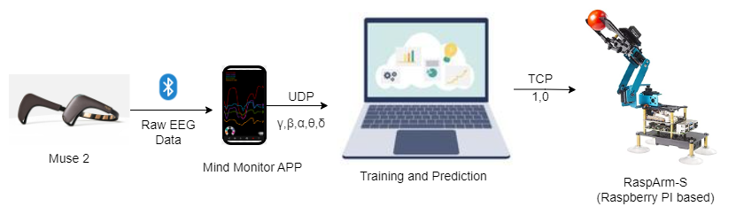

This was my first real introduction to BCI and EEG work.
The idea was simple: can we use a small hobby-grade portable EEG sensor to control a robotic arm?

The project explores whether basic EEG signals can trigger simple robotic actions—like grasping, releasing, or resting—using thought-linked gestures, blinking or jaw clenching.
It was an early experiment, but it showed that even low-cost EEG hardware can drive meaningful control of assistive devices.

### 🧠 Overview
- **Conference Demo:** IEEE Body Sensor Networks (BSN) 2023  
- **Collaborators:** Dr. Mohammad Arif Ul Alam (UMass Lowell), Dr. João Luís G. Rosa (University of São Paulo)  
- **Hardware:** Muse 2 EEG headband, Raspberry Pi-based robotic arm  
- **Objective:** Upper-limb motion control via low-cost, portable EEG interface  

---

###  System Design
The system converts raw EEG signals (alpha, beta, gamma, delta, theta) into control commands using a threshold-based event detector.  A Raspberry Pi processes classified EEG inputs and drives the robotic arm’s motors through serial communication.  

{fig-align="center" width="80%"}

---

###  What I Learned & Why It Was Hard
Training a model to “detect thoughts” with a hobby EEG device is extremely difficult.

Because the Muse 2 only has **four electrodes**, all placed on the **frontal lobe**, the signals mainly reflect:

- Focus  
- Attention  
- Facial muscle movement  

But **intentional movement** comes from the **motor cortex**, that are located at the top of the head…  
far away from where the Muse collects data. This meant true “thought-based motion classification” wasn’t realistic with this device, and the model I made was really just overfitting to my brain patterns, as well as the limited scope of classifying only two distinct motions.  On the other hand, Blinking and Jaw clench events
were very easy to implement.

---

### Impact & Future Work
This proof-of-concept still shows that **affordable EEG sensors** can power **real-time assistive robotics**, even with limited channels.  

But now that I better understand the relationship between brain regions and movement intention, the next step is clear:

- Move from 4 frontal electrodes → to **multi-channel EEG covering the motor cortex**  
- Try a portable headset like the **Emotiv Epoc X**, which actually places electrodes over the movement areas  
- Re-run the study with better spatial coverage    
- Eventually test it in **rehabilitation or assistive-tech contexts**  

At the end, I did discover a really interesting use-case for the Muse. Because of the frontal lobe signals give us access, it’s actually much better suited for studying focus and mental engagement—the whole idea of being in a flow state, or what athletes call “in the zone”. I even ran a small focus study around this concept, which you can check out [here]( https://www.linkedin.com/feed/update/urn:li:activity:7053571331304382464/)

---

###  Resources
- **Code Repository:** [GitHub – NazimBL/EEG-Controlled-Robot](https://github.com/NazimBL/EEG-Controlled-Robot)
- **Publication:** [ResearchGate Article](https://www.researchgate.net/publication/397546710_Brain-Controlled_Robot_for_Assisting_Basic_Upper_Limb_Tasks)

<video controls width="70%">
  <source src="bci-demo-video.mp4" type="video/mp4">
</video>

**Demo Video – EEG-Controlled Robotic Arm (BSN 2023)**