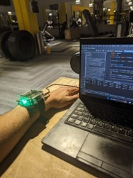
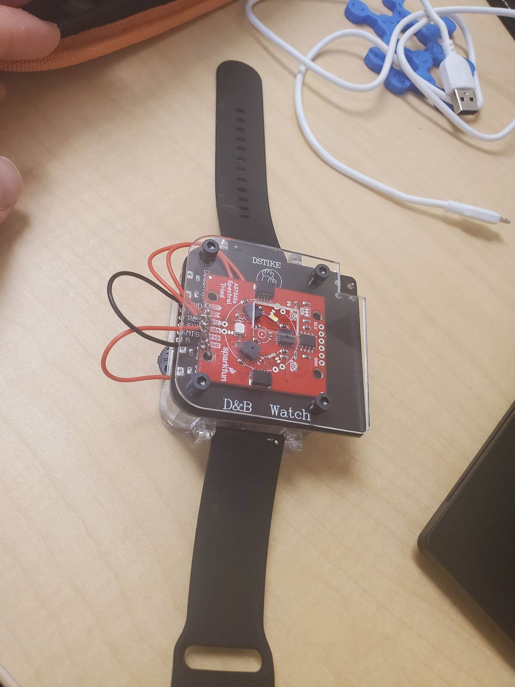
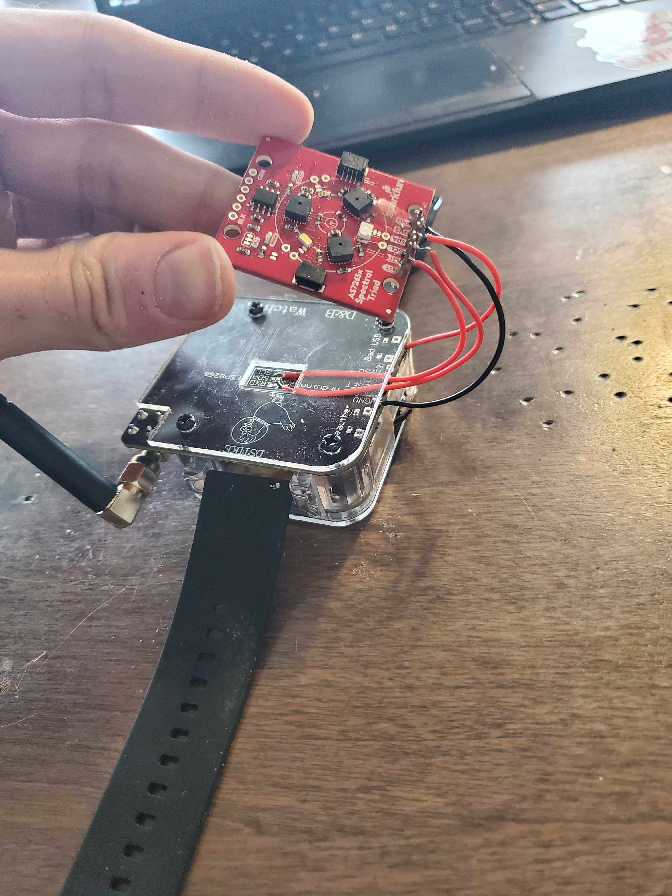
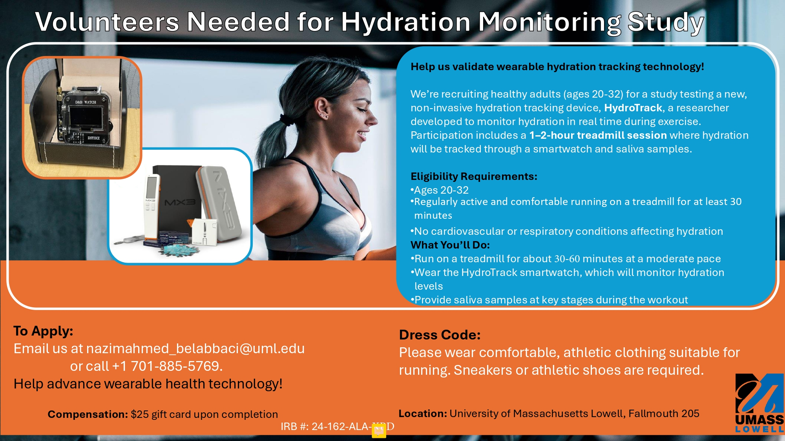

## Overview of the 1st prototype

HydroTrack is the first prototype I made by integrating a low-cost optical sensor into an open-source programmable watch and turning it into a hydration monitor. 
 

- **Hardware** – SparkFun AS7265x Triad spectroscopy sensor embedded in a DSTIKE Watch V4 (ESP32).  
- **Experiments** – Calibration with lab-grade spectrometer (Hach DR3900), electrolyte-solution benchmarking, skin-hydration tests during fasting & exercise.  
- **Deployment** – TinyML model runs fully on-device; LEDs indicate hydration state (green = hydrated, red = dehydrated).  

  
  
  

***

# Methods Summary

### Hardware Integration
The **AS7265x Triad sensor** captures 18 wavelengths (410–940 nm).  
Signals are read via I²C on an ESP32 microcontroller and processed on the watch itself.

### Machine-Learning Pipeline
- **Preprocessing:** noise filtering + Eulerian Video Magnification to amplify subtle optical variations.  
- **Models:** Random Forest and XGBoost for 3 hydration classes: *hydrated*, *mid*, *dehydrated*.  
- **Deployment:** converted to TinyML header files and executed locally on the watch.

### Experiments
1. **Electrolyte calibration with reference solutions:** 
To validate the sensor, we tested several hydration drinks and lab-made sodium and potassium solutions at different concentrations. Their light absorbance was first measured with a professional lab spectrometer and then compared with readings from our wearable optical sensor to assess accuracy 
2. **Tracking hydration change during workout:**
We measured changes in skin absorbance before, during, and after workout sessions to observe how dehydration affects the body’s optical response.

### Beyond the Prototype

After developing the first HydroTrack prototype, I conducted an extensive review of [hydration-monitoring technologies](https://mhealth.jmir.org/2025/1/e60569). 
This helped benchmark HydroTrack against all existing methods and identify the gaps in real-world hydration sensing and what are the most promising aprroaches. 

***

# Next-gen Hydration Research Study: 

I am currently leading an IRB-approved study at UMass Lowell to validate the next-generation HydroTrack device during treadmill exercise.  

### What the study involves
- 1–2 hour laboratory session  
- 30–60 minutes of treadmill running at a moderate pace  
- Wearing the wristband to measure hydration levels  
- Providing **saliva samples** pre- and post-workout stages    

### Call for Participants

---

***
## Publications

- **Belabbaci N.A.**, Alam M.A.U., *HydroTrack: Spectroscopic Analysis Prototype Enabling Real-Time Hydration Monitoring in Wearables*, IEEE EMBC 2024.  
  → [Read on IEEE Xplore](https://ieeexplore.ieee.org/document/10782531)

- **Belabbaci N.A.**, *Wearable Hydration Monitoring Technologies: A Comprehensive Review of 100+ Studies*, *JMIR mHealth and uHealth* 2025; 13:e60569.  
  → [Read on JMIR](https://mhealth.jmir.org/2025/1/e60569)

- **Master’s Thesis** – *A Prototype Smartwatch Utilizing Spectroscopy for Real-Time Monitoring of Hydration Status*, UMass Lowell 2024.  
  → [Download PDF](Nazim_HydroTrack_Thesis.pdf)
